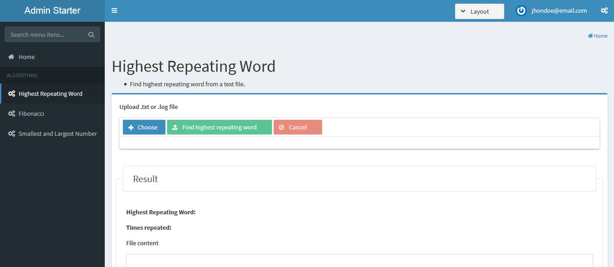
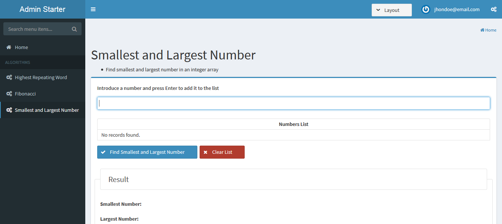

= Frontend for Algorithms Examples Integrating AdminFaces and SpringBoot
:page-layout: base
:source-language: java
:icons: font
:linkattrs:
:sectanchors:
:sectlink:
:numbered:
:doctype: book
:toc: preamble
:tip-caption: :bulb:
:note-caption: :information_source:
:important-caption: :heavy_exclamation_mark:
:caution-caption: :fire:
:warning-caption: :warning:

A simple project based on AdminFaces that integrates Primefaces, Bootstrap and Admin LTE into this JSF application. Consumes a REST API and runs with Spring Boot.

.Login page
image:src/main/resources/images/login.png[]

.Highest Repeating Word

.Fibonacci

.Smallest and Largest Number

== Dependencies

Download the API REST for the backend of this application.

https://github.com/Bresit-Solutions/rest-api-algorithms-back-example

Follow the instructions for run it, described in its Github repository. This API REST
must be running before the AdminFaces frontend.

== Running

This starter runs via *SpringBoot* using the `maven` command:

 
`mvn spring-boot:run` *or* 

`mvn clean package && java -jar target/primefaces-algorithms-front-example.war` *or*

`./run.sh/run.cmd`

The application will be available at http://localhost:8081

== Configure API REST access

In the class `com.bresit.primefaces.algorithms.front.example.api_config.ApiRestConfig`
you can configure the url base of the backend API REST. By default is http://localhost:8080/

== Configure port

To change the default port (8081) you have to modify the file `application.properties`